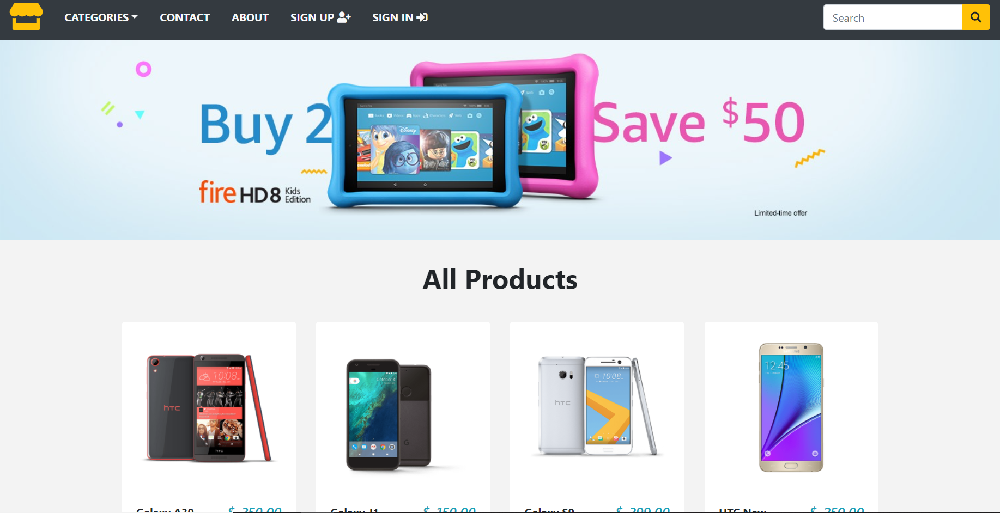

# Ecommerce 

- le lien pour accéder au site web : https://eshop-market.herokuapp.com/

<!-- PROJECT LOGO -->
 

  

  <h3 align="center">Ecommerce</h3>

  

    This project will provides the user with :
    <li> The abilitity to create an acocunt </li>
    <li> Search by category </li>
    <li> Buy online </li>
    <li> Contact the seller </li>
    <li> View their purchase history </li>
  

### Built With

* Python
* Django
* Django Template
* Javascript/Html/Css

### Demo

